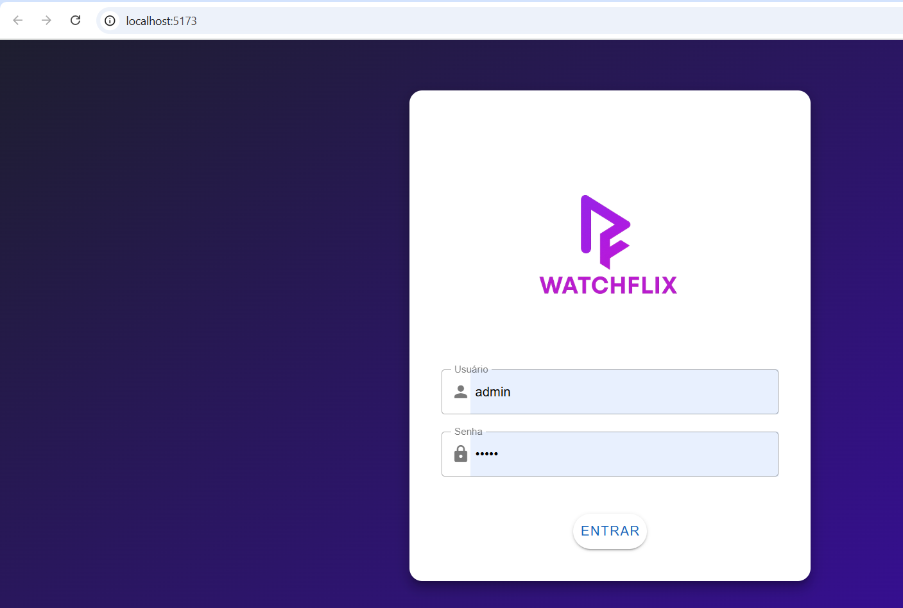
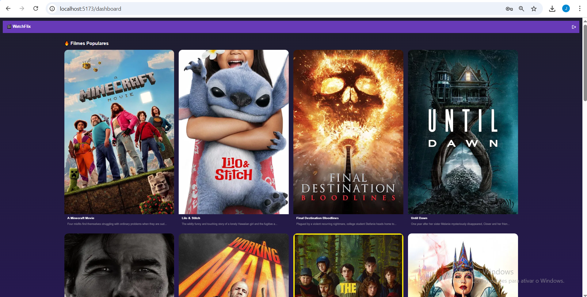

# 🎬 WatchFlix - Recomendador de Filmes em Tempo Real

Este projeto é um sistema de recomendação ao vivo de filmes, inspirado no desafio técnico da Watch Brasil. Ele utiliza:

- 🎨 **Vue 3 + Vite + Vuetify** no Frontend
- ⚙️ **NestJS** no Backend (repositório separado)
- 🔐 Autenticação via JWT
- 🎬 Integração com a API do TMDB

---

## 📦 Tecnologias Usadas

- [Vue.js 3](https://vuejs.org/)
- [Vite](https://vitejs.dev/)
- [Vuetify 3 (Material UI)](https://next.vuetifyjs.com/)
- [Pinia](https://pinia.vuejs.org/) – Store management
- [Axios](https://axios-http.com/) – Requisições HTTP

---

## 🚀 Como rodar o projeto localmente

### Pré-requisitos

- Node.js >= 18
- NPM ou Yarn

### Instalação





```bash
git clone https://github.com/Jonathanbfb/desafiofront.git
cd watchflix-frontend
npm install
